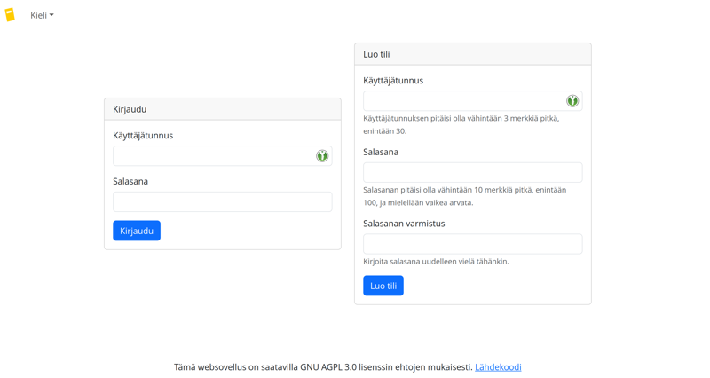
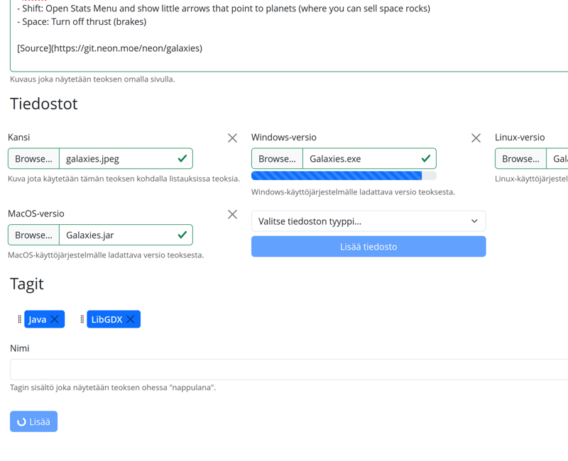
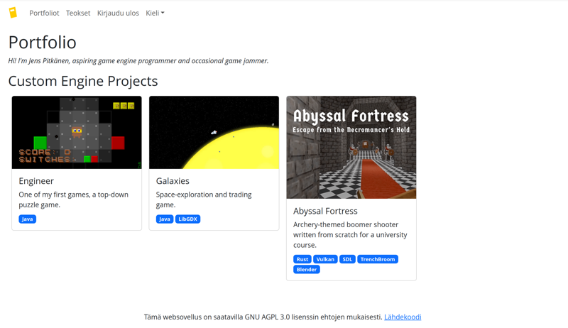
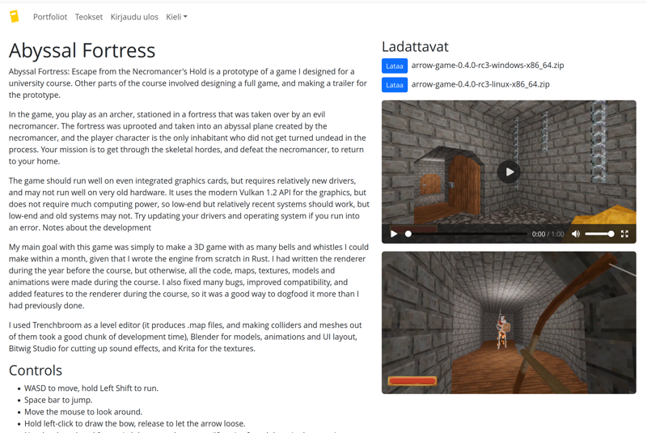

# Fullstack Open harjoitustyö

Tässä repositoriossa on projektini kurssille [Full Stack -websovelluskehitys
harjoitustyö](https://github.com/fullstack-hy2020/misc/blob/master/harjoitustyo.md).
Kyseessä on websovellus, jolla useampi käyttäjä voi luoda portfolio-nettisivuja
järkevällä käyttöliittymällä, erityisellä fokuksella sellaisiin portfolioihin,
jotka koostuvat peleistä ja/tai muista sovelluksista. Sovellus on toteutettu
frontendin osalta Reactilla, Bootstrapilla ja Typescriptillä, ja backendin
puolelta Axumilla, Sqlx:llä ja Rustilla.

Koodikatselmoinnin helpottamiseksi koodikannoista löytyy yleiset kuvaukset
[backend](backend/) ja [frontend](frontend/) hakemistoista. Ne ovat kirjoitettu
englanniksi, että tekninen kieli on sujuvampaa.

## Sisällys

- [Työaikakirjanpito](#työaikakirjanpito)
- [Linkki ja ohjeet](#linkki-ja-ohjeet)
  - [Käyttöohjeet](#käyttöohjeet)
  - [Ylläpitohuomioita](#ylläpitohuomioita)
- [Kuvakaappauksia](#kuvakaappauksia)
- [Lisenssi](#lisenssi)

## Työaikakirjanpito

Alla kirjanpito tähän projektiin käyttämistäni tunneista, kurssin
työtuntivaatimuksien seuraamista varten.

| Päivä | Alku&nbsp;ja&nbsp;loppu | Käytetty&nbsp;aika | Aika&nbsp;yhteensä | Kuvaus |
| :----:|:------------|--------:|---------:|:-------|
| 18.7. | 00.06–02.44 |  2h 38m |   2h 38min | Npm/vite/typescript/cargo/docker/ym. järjestelyä |
| 18.7. | 22.17–23.40 |  1h 23m |   4h  1min | Sovelluksen ydintoimintojen suunnittelua |
| 19.7. | 01.04–03.29 |  2h 25m |   6h 26min | Kunnon readme:n kirjoittaminen, tietokantayhteyksien lisääminen backendiin |
| 19.7. | 16.53–02.54 | 10h  1m |  16h 27min | Kirjautumis- ja rekisteröintilomakkeiden toteutus frontendissä, käyttäjien lisäys ja salasanojen tarkistuksen toteuttaminen backendissä (ei vielä sessioita) |
| 20.7. | 17.00–19.13 |  2h 13m |  18h 40min | Sessioiden lisäys backendiin, vielä vaiheessa frontissa |
| 21.7. | 00.00–00.54 |     54m |  19h 34min | Sessiot toimintaan myös frontin osalta |
| 21.7. | 17.23–21.51 |  4h 28m |  24h  2min | Frontendin bäkkärikutsujen tekemistä varten olevan hookin refaktorointi, nyt integroi paljon paremmin Reactin state-systeemien kanssa, login-kontekstin lisäys, sessioiden vanhentuminen backendiin |
| 22.7. | 09.17–11.17 |  2h     |  26h  2min | Käännösten (ja niiden vaatimien systeemien) lisäämistä frontendiin, navipalkki, routeeminen |
| 22.7. | 14.09–14.57 |     48m |  26h 50min | Käännösten viimeistely, faviconin/"brand ikonin" etsintää ja lisäystä |
| 23.7. | 10.22–11.10 |     48m |  27h 38min | Portfolio-listaus-näkymän työstämistä frontendissä |
| 24.7. | 21.03–23.00 |  1h 57m |  29h 35min | Portfolio-listaus-näkymän viimeistelyä, portfolio-skeeman suunnittelua backendiin |
| 26.7. | 18.33–21.56 |  3h 23m |  32h 58min | Portfolioiden haun toteutus backendissä, portfolioiden haku backendista sekä esimerkkipohjaisen tyyppitarkistussysteemin toteutus frontendissä |
| 29.7. | 13.34–17.22 |  3h 48m |  36h 46min | Api-kutsujen korjailua hitaan netin kanssa tunnistettujen ongelmien osalta, portfolioiden luonti/muokkaus-lomakkeen kehitystä |
| 29.7. | 22.16–23.35 |  1h 19m |  38h  5min | Portfolioiden luomis-ominaisuus (vielä ilman itse teoksia) valmiiksi |
|  1.8. | 19.31–20.21 |     50m |  38h 55min | Portfolioiden muokkaamis-näkymä frontendissä |
|  2.8. | 15.43–17.24 |  1h 41m |  40h 36min | Portfolioiden muokkaamisen lisäys backendiin ja yleisesti toimimaan, jatkon suunnittelua |
|  2.8. | 19.11–21.46 |  2h 35m |  43h 11min | Portfolio-näkymä työn alle, tarvitut refaktoroinnit että julkaistut portfoliot näkee kirjautumatta (ja silloin ilman navia) |
|  5.8. | 13.53–19.20 |  5h 27m |  48h 38min | Portfolioiden julkaisu-ominaisuuden lisäys, teos-kategorioiden lisääminen tietokantaan ja niiden muokkaus-näkymän aloitus frontendissä |
| 10.8. | 16.36–19.26 |  2h 50m |  51h 28min | Teoksien haun lisääminen backendiin, teoslistauksen aloittelua frontendissä |
| 11.8. | 14.22–21.50 |  7h 28m |  58h 56min | Teoksien muokkausnäkymän lisääminen frontendiin |
| 12.8. | 14.33–16.54 |  2h 21m |  61h 17min | Teoksien muokkaus-endpointtien lisääminen backendiin, frontin korjailua |
| 16.8. | 15.50–18.21 |  2h 31m |  63h 48min | Teoksien muokkaus mvp valmiiksi (nyt myös tagit, kuvat) |
| 22.8. | 19.20–20.48 |  1h 28m |  65h 16min | Selkeämmän virheilmoituksen lisääminen tilanteille missä slug on jo käytössä |
| 23.8. | 15.31–23.44 |  8h 13m |  73h 29min | Portfolio-kategoriat valmiiksi, eli nyt teoksia voi lisätä portfolioihin |
| 25.8. | 15.07–23.59 |  8h 52m |  82h 21min | Tuki isommille tiedostoille, ja lataus-systeemi joka mahdollistaa isojen tiedostojen lähettämisen palvelimelta ilman hurjaa muistikäyttöä |
| 28.8. | 14.59–20.48 |  5h 49m |  88h 10min | Isompien tiedostojen viimeistely (uploadit, frontin puoli, yksityiskohtia liittyen teos-liitteiden päivityksiin) |
| 30.8. | 11.46–20.08 |  8h 22m |  96h 32min | Julkisen portfolio-sivun ja teos-sivun tekoa, muokkausnäkymien parantelua, testaamista ja bugien korjausta |
| 31.8. | 13.52–00.02 | 10h 10m | 106h 42min |  |

## Linkki ja ohjeet

Websovellus löytyy seuraavasta osoitteesta: <https://portfolio-app-frontend-7287.fly.dev>

### Käyttöohjeet

Lähtökohtaisesti olen pyrkinyt tekemään sovelluksesta suoraviivaisen ja selkeän,
ja esimerkiksi kaikissa lomakkeiden kentissä on mukana lyhyt selitys niiden
tarkoituksista. Tässä kuitenkin lyhyet kuvaukset sovelluksen pääominaisuuksista.

#### Kieli

Sovellus on käännetty sekä englanniksi että suomeksi. Oletuksena käytetään
selaimen kieltä, mutta tämän voi muuttaa navigaatiopalkin Kieli/Language
-valikosta.

#### Käyttäjätilit

Lukuunottamatta julkaistujen portfolioiden katselua, kaikki toiminnallisuudet
tässä sovelluksessa vaativat kirjautumisen, ja kirjautumatta minkä vaan sivun
avaaminen tuokin esille kirjautumis/rekisteröitymissivun.

Luo siis alkuun tili osoitteessa: <https://portfolio-app-frontend-7287.fly.dev>

#### Portfoliot

Portfoliot ovat koko sovelluksen ydin, niitä tällä on tarkoitus luoda, ylläpitää
ja esitellä. Käyttäjät voivat selata ja luoda useampia portfolioita sovelluksen
etusivulla.

Muokkausnäkymä aukeaa kun avaa olemassaolevan portfolion "Muokkaa" linkin, tai
kun luo uuden portfolion. Tässä näkymässä portfoliolle voi täyttää monia
tietoja, joilla lopulta portfolion varsinainen esittelysivu täytetään.
"Julkaise"-vivulla portfolion voi piilottaa julkiselta selaamiselta, ja
vastaavasti laittaa sen julkisesti esille (ilman kirjautumista).

Portfoliot sisältävät "kategorioita" jotka muodostavat portfoliosivulla
erilliset osiot, missä teoksia esitellään. Jokainen kategoria koostuu yhdestä
tai useammasta teoksesta, ja sama teos voi kuulua useampaan kategoriaan.
Kategorioita voi lisätä muokkausnäkymässä "Uusi kategoria" kentän avulla, ja
kategorioihin voi lisätä teoksia "Lisää teos" valikkojen avulla.

#### Teokset

Portfolioiden tarkoitus on esitellä mitä portfolion esittelijä on saanut aikaan,
joten toinen puolikas sovelluksesta on omistettu näille aikaansaannoksille,
joita sovelluksessa kutsutaan "teoksiksi".

Teoksilla on samanlainen listaus kuin portfolioillakin, ja sinne pääsee
navigaatiopalkin "Teokset" linkistä. Uusien luominen ja muokkaaminen tapahtuu
samaan tapaan kuin portfolioiden kanssa.

Teoksille voi mm. sisällyttää "tageja" jotka näkyy sinisinä, helposti
eroteltavina elementteinä, kun teoksia listataan portfolionäkymässä. Esimerkiksi
ohjelmointiprojekteista koostuva portfolio voisi merkitä ohjelmointikieliä ja
tärkeitä kirjastoja tageina.

Viimeisenä nostona, teoksille voi lisätä liitetiedostoja. Erityisesti "Kansi"
tyyppinen liitetiedosto kannattaa lisätä, sillä kyseinen kuva näytetään teoksen
ohessa portfolionäkymässä. Kuvista koostuva portfolio on mukavampaa katsottavaa
kuin pelkkä teksti!

#### Liitetiedostot

Liitetiedostoja tallentaessa teoksiin on hyvä huomioida, että jos tiedoston
tallentaminen jää kesken, voi puolikas tiedosto jäädä käyttäjälle ladattavaksi.
Tässä tapauksessa kannattaa joko poistaa liitetiedosto, tai yrittää tallentaa se
uudestaan loppuun asti, ettei portfolion selailijat turhaan joudu lataamaan
korruptoitunutta tiedostoa.

Latauspalkit seuraavat tiedoston todellista latausta n. 20 kilotavun
tarkkuudella, joten mikäli palkki täyttyy loppuun asti ja katoaa, voi tiedoston
melko hyvin luottaa tallentuneen kokonaisuudessaan. Toki kannattaa ladata
tiedosto varsinaiselta teoksen sivulta ja varmistaa, mikäli yhteysongelmia on.
(Tältä osin projektia voisi vielä erityisesti parantaa, mutta tunnit tuli jo
jonkin aikaa sitten täyteen 5op suoritusta varten, niin jätän myöhemmäksi.)

### Ylläpitohuomioita

#### Tietokantayhteydet

Tämän sovelluksen backend voi käyttää PostgreSQL tai SQLite -tietokantaa.
Käytetty tietokanta riippuu backendin saamasta DATABASE_URL
ympäristömuuttujasta, jonka muodostamiseen löytyy ohjeet seuraavista linkeistä:
[PostgreSQL](https://docs.rs/sqlx/latest/sqlx/postgres/struct.PgConnectOptions.html),
[SQLite](https://docs.rs/sqlx/latest/sqlx/sqlite/struct.SqliteConnectOptions.html).

Kehitysympäristön docker compose -konfiguraatiossa käytetään SQLite-tietokantaa,
joka tallentuu bind-mountattuun tiedostoon
[backend/dev-compose-data.db](backend/dev-compose-data.db).

## Kuvakaappauksia

| | |
|:---:|:---:|
|  | |
|  |  |

## Lisenssi

Tätä websovellusta saa käyttää, tutkia, kopioda ja muokata [GNU AGPL
3.0](LICENSE.md) lisenssin ehtojen mukaisesti.
